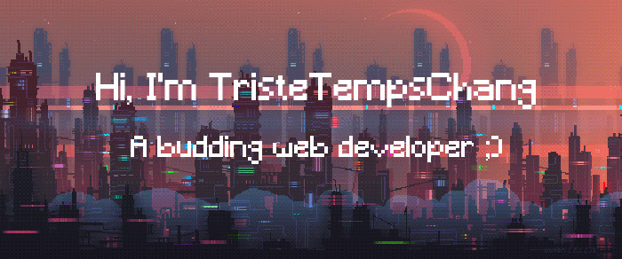

    <h1 align="center">Hello 👋, nice to meet you !</h1>
    <h3 align="center">I'm very excited to show you all my project :)</h3>
     

    
    
    

 
 

<h2>About Me</h2>

    <ul>
        <li>
            🔭 I'm currently working on a web pokemon game
        </li>
         
        <li>
            🌱 I'm currently learning Phaser JS
        </li>
         
        <li>
            💬 Ask me about web development and vacation
        </li>
         
        <li>
            📬 How to reach me : tristan.tran2111@gmail.com
        </li>
         
        <li>
            ⭐ Fun fact ... <strong>I don't sleep very much :'(</strong>
        </li>
    </ul>

 
 
<h2>My skills</h2>

    
    
    
    
    
    
    
    
    
    
    
    
    

 
 
<h2>My GitHub Stats</h2>

    
    
    

